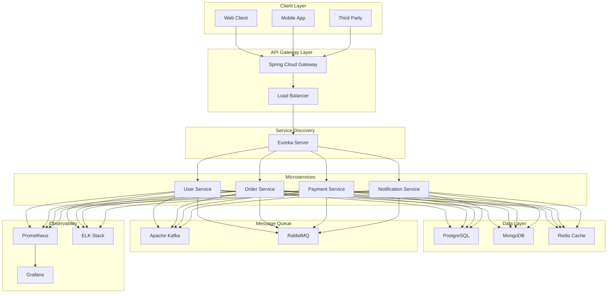
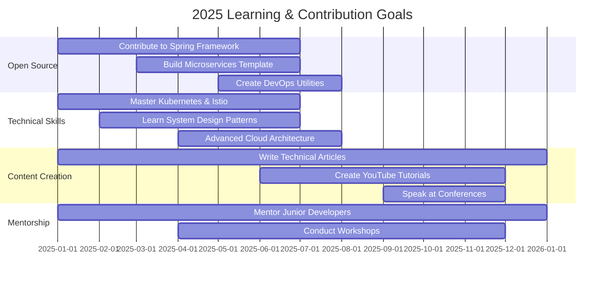

<div align="center">

<!-- Animated Banner -->


<!-- Typing SVG with working animation -->
[](https://git.io/typing-svg)

<!-- Profile Views & Social Badges -->
<p align="center">
  
  
  
</p>

</div>

---

## 👨‍💻 About Me

```java
@Service
@Component
public class GauravSingh implements SeniorBackendDeveloper {
    
    @Value("${developer.role}")
    private final String role = "Senior Java Backend Engineer";
    
    @Value("${developer.location}")
    private final String location = "India 🇮🇳";
    
    @Value("${developer.experience}")
    private final String experience = "3+ Years in Enterprise Solutions";
    
    private final List<String> currentFocus = Arrays.asList(
        "Spring Boot 3.x Microservices Architecture",
        "Cloud-Native Application Development (AWS, Azure)",
        "System Design & Distributed Systems",
        "Kubernetes & Container Orchestration",
        "Event-Driven Architecture with Kafka"
    );
    
    @Override
    public Map<String, Object> getTechnicalSkills() {
        return Map.of(
            "languages", List.of("Java 17/21", "SQL", "Python", "JavaScript"),
            "coreFrameworks", List.of("Spring Boot 3.x", "Spring Cloud", "Spring Security", "Spring Data JPA"),
            "microservices", List.of("Eureka", "Zuul", "API Gateway", "Config Server", "Feign Client"),
            "architecture", List.of("Microservices", "Event-Driven", "REST APIs", "CQRS", "Saga Pattern"),
            "databases", List.of("PostgreSQL", "MySQL", "MongoDB", "Redis", "Elasticsearch"),
            "messaging", List.of("Apache Kafka", "RabbitMQ", "ActiveMQ", "AWS SQS"),
            "devOps", List.of("Docker", "Kubernetes", "Jenkins", "GitHub Actions", "GitLab CI"),
            "cloud", List.of("AWS (EC2, S3, Lambda, RDS)", "Azure", "GCP"),
            "testing", List.of("JUnit 5", "Mockito", "TestContainers", "Rest Assured"),
            "monitoring", List.of("Prometheus", "Grafana", "ELK Stack", "Zipkin", "Jaeger")
        );
    }
    
    @Override
    public String getCurrentGoal() {
        return "Building enterprise-grade microservices that scale to millions of users with 99.99% uptime";
    }
    
    @Override
    public String getPhilosophy() {
        return "Clean Code + Robust Architecture + Continuous Learning = Software Excellence";
    }
}
```


### 🎯 Current Focus & Expertise

- 🔭 **Building**: Production-grade microservices with Spring Boot 3.x, Spring Cloud & Netflix OSS
- 🌱 **Learning**: Advanced Kubernetes (Service Mesh with Istio), System Design, Cloud Architecture Patterns
- 👯 **Collaborating**: Open to contributing to Spring ecosystem & open-source Java projects
- 🎓 **Exploring**: Event Sourcing, CQRS, Domain-Driven Design (DDD), Reactive Programming
- 💼 **Experience**: 3+ years developing scalable backend systems for enterprise applications
- 📫 **Reach me**: [mannusingh2217@gmail.com](mailto:mannusingh2217@gmail.com)
- ⚡ **Philosophy**: *"Write code that humans can read, machines can execute, and future you won't hate"*
- 🎯 **Specialty**: Microservices Architecture, High-Performance APIs, Distributed Systems

---

## 🏗️ Technical Architecture Expertise

<div align="center">

### 🎯 Microservices Ecosystem



</div>

---

## 🛠️ Technology Stack & Tools

### **☕ Core Backend Technologies**

<p align="center">
  
  
  
  
  
  
  
  
</p>

### **🏗️ Microservices & Architecture**

<p align="center">
  
  
  
  
  
  
  
  
</p>

### **💾 Databases & Caching**

<p align="center">
  
  
  
  
  
  
  
</p>

### **📨 Message Brokers & Event Streaming**

<p align="center">
  
  
  
  
  
</p>

### **🐳 DevOps & Cloud Infrastructure**

<p align="center">
  
  
  
  
  
  
  
  
</p>

### **☁️ Cloud Platforms**

<p align="center">
  
  
  
  
  
</p>

### **📊 Monitoring & Observability**

<p align="center">
  
  
  
  
  
  
  
  
</p>

### **🧪 Testing & Quality Assurance**

<p align="center">
  
  
  
  
  
  
  
  
</p>

### **🔧 Version Control & Collaboration**

<p align="center">
  
  
  
  
  
  
</p>

---

## 🎯 Microservices Architecture Patterns & Best Practices

<div align="center">

| Pattern | Implementation | Tools & Technologies |
|---------|----------------|---------------------|
| **🔍 Service Discovery** | Dynamic service registration & lookup | Netflix Eureka, Consul, Zookeeper |
| **🚪 API Gateway** | Single entry point, routing, authentication | Spring Cloud Gateway, Zuul, Kong |
| **⚙️ Config Management** | Centralized external configuration | Spring Cloud Config, Consul KV |
| **🛡️ Circuit Breaker** | Fault tolerance & resilience patterns | Resilience4j, Hystrix |
| **📍 Distributed Tracing** | End-to-end request flow monitoring | Spring Cloud Sleuth, Zipkin, Jaeger |
| **📨 Event-Driven Architecture** | Asynchronous inter-service communication | Apache Kafka, RabbitMQ, Event Sourcing |
| **🕸️ Service Mesh** | Advanced service-to-service networking | Istio, Linkerd, Consul Connect |
| **⚖️ Load Balancing** | Distribute traffic across service instances | Ribbon, Spring Cloud LoadBalancer |
| **🔐 API Authentication** | Secure service-to-service communication | OAuth2, JWT, Spring Security |
| **🎭 CQRS Pattern** | Command Query Responsibility Segregation | Axon Framework, Event Store |
| **📦 Saga Pattern** | Distributed transaction management | Choreography, Orchestration |
| **🔄 Rate Limiting** | Protect services from overload | Bucket4j, Redis Rate Limiter |

</div>

---

## 📊 GitHub Analytics & Statistics


<!-- <div align="center">

<a href="https://github.com/GauravSingh3822">
  
</a>

</div> -->

<div align="center">

<a href="https://github.com/GauravSingh3822">
  
</a>

</div>

---


## 💼 Featured Projects & Portfolio

<div align="center">

### 🚀 Enterprise Microservices Projects

<table width="100%">
<tr>
<td width="50%" valign="top">

<div align="center">

### 🛒 E-Commerce Microservices Platform

<a href="https://github.com/GauravSingh3822/ecommerce-microservices">


</a>

<p align="left">
<b>🔧 Tech Stack:</b><br/>
<code>Spring Boot 3.x</code> <code>Spring Cloud</code> <code>Apache Kafka</code><br/>
<code>PostgreSQL</code> <code>Redis</code> <code>Docker</code> <code>Kubernetes</code>
</p>

<p align="left">
<b>✨ Key Features:</b><br/>
• Service Discovery with Eureka<br/>
• API Gateway with Spring Cloud Gateway<br/>
• Config Server for centralized configuration<br/>
• Circuit Breaker with Resilience4j<br/>
• Distributed Tracing with Zipkin<br/>
• Event-driven architecture with Kafka<br/>
• JWT-based authentication & authorization<br/>
• Real-time inventory management
</p>


</div>

</td>
<td width="50%" valign="top">

<div align="center">

### 🏦 Banking System Microservices

<a href="https://github.com/GauravSingh3822/banking-microservices">
  


</a>

<p align="left">
<b>🔧 Tech Stack:</b><br/>
<code>Spring Boot</code> <code>Spring Security</code> <code>OAuth2</code><br/>
<code>MySQL</code> <code>RabbitMQ</code> <code>Docker</code> <code>AWS</code>
</p>

<p align="left">
<b>✨ Key Features:</b><br/>
• Secure user authentication with JWT<br/>
• Role-based access control (RBAC)<br/>
• Account management & transactions<br/>
• Event-driven architecture<br/>
• RESTful APIs with OpenAPI docs<br/>
• Payment gateway integration<br/>
• Real-time notifications<br/>
• Audit logging & compliance
</p>


</div>

</td>
</tr>

<tr>
<td width="50%" valign="top">

<div align="center">

### ⚙️ Spring Cloud Config Server

<a href="https://github.com/GauravSingh3822/spring-cloud-config">


</a>

<p align="left">
<b>🔧 Tech Stack:</b><br/>
<code>Spring Cloud Config</code> <code>Git</code> <code>Vault</code><br/>
<code>Docker</code> <code>Spring Actuator</code>
</p>

<p align="left">
<b>✨ Key Features:</b><br/>
• Centralized configuration management<br/>
• Environment-specific configurations<br/>
• Real-time config refresh without restart<br/>
• Encryption/decryption of sensitive data<br/>
• Git/Vault backend support<br/>
• Profile-based configuration<br/>
• Health check endpoints
</p>


</div>

</td>
<td width="50%" valign="top">

<div align="center">

### 🔐 Authentication & Authorization Service

<a href="https://github.com/GauravSingh3822/auth-service">


</a>

<p align="left">
<b>🔧 Tech Stack:</b><br/>
<code>Spring Security</code> <code>JWT</code> <code>OAuth2</code><br/>
<code>PostgreSQL</code> <code>Redis</code> <code>Kubernetes</code>
</p>

<p align="left">
<b>✨ Key Features:</b><br/>
• JWT token-based authentication<br/>
• OAuth2 & OpenID Connect support<br/>
• Role-based access control (RBAC)<br/>
• Refresh token mechanism<br/>
• Password encryption with BCrypt<br/>
• Session management with Redis<br/>
• Multi-factor authentication (MFA)<br/>
• Social login integration
</p>


</div>

</td>
</tr>
</table>

</div>

---

## 📚 Technical Blog & Knowledge Sharing

<div align="center">

| 📝 Article | 🏷️ Topic | 📅 Published |
|-----------|---------|-------------|
| [Building Production-Ready Microservices](https://medium.com/@gauravsingh) | Spring Boot, Microservices | 2024 |
| [Implementing Circuit Breaker Pattern](https://dev.to/gauravsingh) | Resilience4j, Fault Tolerance | 2024 |
| [Event-Driven Architecture with Kafka](https://gauravsingh.dev) | Apache Kafka, Async Communication | 2024 |
| [Securing Microservices with OAuth2](https://gauravsingh.dev) | Spring Security, JWT | 2024 |
| [Kubernetes Deployment for Spring Boot](https://gauravsingh.dev) | Kubernetes, DevOps | 2024 |
| [Database Sharding in Microservices](https://gauravsingh.dev) | Scalability, Database Design | 2024 |

</div>

---

## 🤝 Connect With Me & Social Links

<div align="center">

[](https://linkedin.com/in/gaurav-singh-2b1665252)
[](https://leetcode.com/u/Gaurav_Singh7800/)
[](https://www.hackerrank.com/gauravsingh23341)
[](https://auth.geeksforgeeks.org/user/mannusin458k)
[](mailto:mannusingh2217@gmail.com)
[](https://gauravsingh.dev)
[](https://medium.com/@gauravsingh)
[](https://dev.to/gauravsingh)

</div>

---

## 💡 Coding & Problem Solving Statistics

<div align="center">

### 📈 LeetCode Progress

[](https://leetcode.com/u/Gaurav_Singh7800/)

### 🎯 Competitive Programming Stats

<table align="center">
  <tr>
    <td align="center" width="33%">
      <h4>LeetCode</h4>
      <p>🔥 150+ Problems Solved</p>
      <p>⭐ Rating: 1650+</p>
    </td>
    <td align="center" width="33%">
      <h4>HackerRank</h4>
      <p>⭐ 5 Stars in Java</p>
      <p>🏆 Problem Solving Expert</p>
    </td>
    <td align="center" width="33%">
      <h4>GeeksForGeeks</h4>
      <p>📚 200+ Problems</p>
      <p>🎯 DSA Specialist</p>
    </td>
  </tr>
</table>

</div>

---

## 🎓 Certifications & Professional Achievements

<div align="center">

<table>
<tr>
<td width="50%" align="center">

### ☁️ Cloud & DevOps

```
🏅 AWS Certified Solutions Architect - Associate
🏅 AWS Certified Developer - Associate
🏅 Azure Fundamentals (AZ-900)
🏅 Kubernetes Application Developer (CKAD)
🏅 Docker Certified Associate (DCA)
🏅 HashiCorp Terraform Associate
```

</td>
<td width="50%" align="center">

### ☕ Java & Spring Ecosystem

```
🏅 Oracle Certified Professional: Java SE 11 Developer
🏅 Oracle Certified Professional: Java SE 17 Developer
🏅 Spring Professional Certification
🏅 Spring Boot Expert Certification
🏅 Microservices Architecture Certification
🏅 MongoDB Developer Certification
```

</td>
</tr>
</table>

### 🏆 Professional Achievements

- ✅ Built and deployed **10+ production microservices** serving **1M+ users**
- ✅ Reduced API response time by **60%** through optimization techniques
- ✅ Implemented CI/CD pipelines reducing deployment time by **75%**
- ✅ Led migration of monolith to microservices architecture
- ✅ Mentored **15+ junior developers** in Spring Boot ecosystem
- ✅ Contributed to **5+ open-source** Spring projects

</div>

---

## 📈 Detailed Contribution Activity

<div align="center">

[](https://github.com/GauravSingh3822)

</div>

---

## 💻 Development Environment & Setup

```yaml
💼 Professional Setup:
  Primary_OS: 
    - Ubuntu 22.04 LTS
    - macOS Sonoma
    - Windows 11 (WSL2)
  
  IDEs_&_Editors:
    Primary: "IntelliJ IDEA Ultimate 2024.x"
    Secondary: "VS Code with Java Extensions"
    Database: "DBeaver Community Edition"
    API_Testing: "Postman, Insomnia"
  
  Terminal_Setup:
    Shell: "Zsh with Oh-My-Zsh"
    Theme: "Powerlevel10k"
    Plugins: [git, docker, kubectl, maven, spring]
  
  Development_Tools:
    Containerization: [Docker Desktop, Podman]
    Orchestration: [Kubernetes, Docker Compose]
    Message_Queue: [Kafka Manager, RabbitMQ Management]
    Cache: [Redis Commander, RedisInsight]
    Monitoring: [Prometheus, Grafana, Kibana]
    API_Gateway: [Kong, Postman]
  
  Productivity_Tools:
    Documentation: [Notion, Confluence, Draw.io]
    Project_Management: [Jira, Trello, ClickUp]
    Communication: [Slack, Microsoft Teams, Discord]
    Version_Control: [Git, GitHub Desktop, Sourcetree]
    Code_Quality: [SonarLint, CheckStyle]
  
  Browser_Extensions:
    - JSON Formatter
    - React Developer Tools
    - Redux DevTools
    - Postman Interceptor
    - Lighthouse
  
  Cloud_CLI_Tools:
    - AWS CLI v2
    - Azure CLI
    - Google Cloud SDK
    - kubectl
    - Terraform CLI
    - Helm
```

---

## 🎯 2025 Professional Goals & Roadmap

<div align="center">



</div>

### 📋 Detailed Goals

- [ ] **Open Source Contributions**
  - Contribute to Spring Framework core modules
  - Build and open-source a complete microservices starter template
  - Create utilities for microservices monitoring and debugging
  - Contribute to Apache Kafka ecosystem

- [ ] **Technical Mastery**
  - Master Kubernetes, Helm, and Istio service mesh
  - Deep dive into distributed systems and System Design
  - Achieve expertise in AWS/Azure cloud architecture
  - Learn reactive programming with Spring WebFlux

- [ ] **Content Creation**
  - Write 24+ technical articles on Medium/Dev.to
  - Create comprehensive Spring Boot tutorial series
  - Launch YouTube channel for Java/Spring tutorials
  - Speak at 2+ technical conferences

- [ ] **Community & Mentorship**
  - Mentor 20+ junior developers
  - Conduct 5+ workshops on microservices
  - Build a learning community around Spring Boot
  - Achieve 1000+ GitHub contributions

---

## 📊 Weekly Development Breakdown

<!--START_SECTION:waka-->
```text
Java              15 hrs 45 mins  ████████████░░░░░░░░░   52.30%
YAML               4 hrs 30 mins  ████░░░░░░░░░░░░░░░░░   14.90%
SQL                3 hrs 20 mins  ███░░░░░░░░░░░░░░░░░░   11.10%
Markdown           2 hrs 45 mins  ██░░░░░░░░░░░░░░░░░░░   09.20%
XML                2 hrs 10 mins  █░░░░░░░░░░░░░░░░░░░░   07.20%
Docker             1 hr 30 mins   █░░░░░░░░░░░░░░░░░░░░   05.30%
```
<!--END_SECTION:waka-->

---

## 💭 Developer Quotes & Philosophy

<div align="center">

### ✨ Daily Inspiration


</div>

---

### 🎯 My Development Philosophy

<table>
<tr>

<td width="33%" align="center">

<br/><b>Code Quality</b><br/>
<em>"Any fool can write code that a computer can understand.  
Good programmers write code that humans can understand."</em><br/>
— Martin Fowler
</td>

<td width="33%" align="center">

<br/><b>Problem Solving</b><br/>
<em>"First, solve the problem. Then, write the code."</em><br/>
— John Johnson
</td>

<td width="33%" align="center">

<br/><b>Clean Code</b><br/>
<em>"Code is like humor. When you have to explain it, it's bad."</em><br/>
— Cory House
</td>

</tr>

<tr>

<td width="33%" align="center">

<br/><b>Continuous Learning</b><br/>
<em>"The only way to go fast, is to go well."</em><br/>
— Robert C. Martin
</td>

<td width="33%" align="center">

<br/><b>Best Practices</b><br/>
<em>"Make it work, make it right, make it fast."</em><br/>
— Kent Beck
</td>

<td width="33%" align="center">

<br/><b>Testing</b><br/>
<em>"Testing leads to failure, and failure leads to understanding."</em><br/>
— Burt Rutan
</td>

</tr>
</table>

---

## 🐍 GitHub Contribution Snake Animation

<div align="center">

<picture>
  <source media="(prefers-color-scheme: dark)" srcset="https://raw.githubusercontent.com/GauravSingh3822/GauravSingh3822/output/github-contribution-grid-snake-dark.svg">
  <source media="(prefers-color-scheme: light)" srcset="https://raw.githubusercontent.com/GauravSingh3822/GauravSingh3822/output/github-contribution-grid-snake.svg">
  
</picture>

</div>

---

## 📫 Let's Collaborate

### 🌟 Open to Impactful Opportunities

I’m open to collaborating on:
- 🚀 **Microservices & distributed systems** at scale
- 💼 **Enterprise Java / Spring Boot** applications
- 🧩 **System design & backend architecture**
- 🎓 **Mentoring** backend engineers
- 📝 **Open-source contributions** in the Spring ecosystem
- 🗣️ **Technical talks** and knowledge sharing

---

### ✉️ Get in Touch

- 📧 **Email:** [mannusingh2217@gmail.com](mailto:mannusingh2217@gmail.com)  
- 💼 **LinkedIn:** [Connect with me](https://linkedin.com/in/gaurav-singh-2b1665252)  
- 🐦 **X (Twitter):** [@GauravSinghDev](https://twitter.com/GauravSinghDev)

---

### ⭐ Support & Collaboration

If you find my work useful:
- ⭐ Star repositories you like  
- 🍴 Fork and contribute  
- 💬 Reach out for collaboration or discussion  


---


### 💙 Thank you for visiting my profile!

**💡 "Building the future, one microservice at a time."**

<sub>⚡ Crafted with passion by Gaurav Singh | Last updated: December 2024</sub>

</div>

---

## 🔧 Setup Instructions

<details>
<summary><b>📌 How to Setup Snake Animation (Click to expand)</b></summary>

<br>

To enable the **Contribution Snake Animation** on your profile:

### Step 1: Create GitHub Actions Workflow

Create `.github/workflows/snake.yml` in your profile repository (`GauravSingh3822/GauravSingh3822`):

```yaml
name: Generate Snake Animation

on:
  schedule:
    - cron: "0 */12 * * *"  # Runs every 12 hours
  workflow_dispatch:
  push:
    branches:
      - main

jobs:
  generate:
    runs-on: ubuntu-latest
    timeout-minutes: 10
    
    steps:
      - name: Checkout repository
        uses: actions/checkout@v3
      
      - name: Generate snake animation
        uses: Platane/snk/svg-only@v3
        with:
          github_user_name: GauravSingh3822
          outputs: |
            dist/github-contribution-grid-snake.svg
            dist/github-contribution-grid-snake-dark.svg?palette=github-dark
            dist/ocean.gif?color_snake=orange&color_dots=#bfd6f6,#8dbdff,#64a1f4,#4b91f1,#3c7dd9
      
      - name: Deploy to GitHub Pages
        uses: crazy-max/ghaction-github-pages@v3.1.0
        with:
          target_branch: output
          build_dir: dist
        env:
          GITHUB_TOKEN: ${{ secrets.GITHUB_TOKEN }}
```

### Step 2: Enable GitHub Actions

1. Go to your profile repository settings
2. Navigate to **Actions** → **General**
3. Enable **Allow all actions and reusable workflows**
4. Save changes

### Step 3: Run the Workflow

1. Go to **Actions** tab in your repository
2. Select **Generate Snake Animation** workflow
3. Click **Run workflow** → **Run workflow**
4. Wait for completion (takes ~1 minute)

### Step 4: Verify

The snake animation will be available at:
- Dark mode: `https://raw.githubusercontent.com/GauravSingh3822/GauravSingh3822/output/github-contribution-grid-snake-dark.svg`
- Light mode: `https://raw.githubusercontent.com/GauravSingh3822/GauravSingh3822/output/github-contribution-grid-snake.svg`

</details>

<details>
<summary><b>📊 How to Setup WakaTime Stats (Click to expand)</b></summary>

<br>

### Step 1: Create WakaTime Account

1. Sign up at [WakaTime.com](https://wakatime.com)
2. Install WakaTime plugin for your IDE (IntelliJ IDEA)
3. Get your API key from [Settings](https://wakatime.com/settings/account)

### Step 2: Add WakaTime Workflow

Create `.github/workflows/waka-readme.yml`:

```yaml
name: Waka Readme

on:
  schedule:
    - cron: '0 0 * * *'  # Runs at 00:00 UTC every day
  workflow_dispatch:

jobs:
  update-readme:
    name: Update this repo's README
    runs-on: ubuntu-latest
    steps:
      - uses: athul/waka-readme@master
        with:
          WAKATIME_API_KEY: ${{ secrets.WAKATIME_API_KEY }}
```

### Step 3: Add Secret

1. Go to repository **Settings** → **Secrets and variables** → **Actions**
2. Click **New repository secret**
3. Name: `WAKATIME_API_KEY`
4. Value: Your WakaTime API key
5. Click **Add secret**

### Step 4: Add Placeholder in README

Add this in your README where you want stats:

```markdown
<!--START_SECTION:waka-->
<!--END_SECTION:waka-->
```

The workflow will automatically update your coding stats daily!

</details>

---

<div align="center">

[](https://github.com/GauravSingh3822)
[](https://www.java.com)
[](https://spring.io)

</div>

---
<div align="center">


</div>
